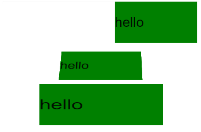
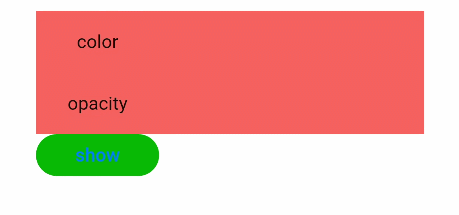

# Animation<a name="EN-US_TOPIC_0000001063908646"></a>

-   [Static Animation](#section456613911492)
-   [Continuous Animation](#section17836125204914)

Animations are classified into  [Static Animation](#section456613911492)  and  [Continuous Animation](#section17836125204914).

## Static Animation<a name="section456613911492"></a>

The transform attributes are the core of static animation. Static animation can transform in the following three ways and only once in each way at a time:

-   **translate**: Moves a specified component horizontally or vertically.
-   **scale**: Scales a specified component horizontally or vertically to the required scale.
-   **rotate**: Rotates a specified component by a specified angle along the horizontal axis, vertical axis, or center point.

The following is an example:

```
<!-- xxx.hml -->
<div class="container">
  <text class="translate">hello</text>
  <text class="rotate">hello</text>
  <text class="scale">hello</text>
</div>
```

```
/* xxx.css */
.container {
  flex-direction: column;
  align-items: center;
}
.translate {
  height: 150px;
  width: 300px;
  font-size: 50px;
  background-color: #008000;
  transform: translate(200px);
}
.rotate {
  height: 150px;
  width: 300px;
  font-size: 50px;
  background-color: #008000;
  transform-origin: 200px 100px;
  transform: rotateX(45deg);
}
.scale {
  height: 150px;
  width: 300px;
  font-size: 50px;
  background-color: #008000;
  transform: scaleX(1.5);
}
```

**Figure  1**  Static animation<a name="fig454415020219"></a>  


## Continuous Animation<a name="section17836125204914"></a>

The static animation has only the start and end states. To set the transition state and conversion effect, use continuous animations.

The core of a continuous animation is animation attributes, which define the start and end states of the animation and the curve of time and speed. Animation attributes can implement the following effects:

-   **animation-name**: Background color, transparency, width, height, and transformation type applied to the element after the animation is executed
-   **animation-delay**  and  **animation-duration**: Element delay and duration after the animation is executed
-   **animation-timing-function**: Speed curve of an animation, which makes the animation more fluent
-   **animation-iteration-count**: Number of animation playback times
-   **animation-fill-mode**: Whether to restore the initial state after the animation is executed

To use the animation attributes, you need to define a @keyframes rule in the  **.css**  file, set the animation transition effect in @keyframes, and invoke the effect through a style class in the  **.hml**  file. The following is an example for  **animation-name**:

```
<!-- xxx.hml -->
<div class="item-container">
  <text class="header">animation-name</text>
  <div class="item {{colorParam}}">
    <text class="txt">color</text>
  </div>
  <div class="item {{opacityParam}}">
    <text class="txt">opacity</text>
  </div>
  <input class="button" type="button" name="" value="show" onclick="showAnimation"/>
</div>
```

```
/* xxx.css */
.item-container {
  margin-right: 60px;
  margin-left: 60px;
  flex-direction: column;
}
.header {
  margin-bottom: 20px;
}
.item {
  background-color: #f76160;
}
.txt {
  text-align: center;
  width: 200px;
  height: 100px;
}
.button {
  width: 200px;
  font-size: 30px;
  background-color: #09ba07;
}
.color {
  animation-name: Color;
  animation-duration: 8000ms;
}
.opacity {
  animation-name: Opacity;
  animation-duration: 8000ms;
}
@keyframes Color {
  from {
    background-color: #f76160;
  }
  to {
    background-color: #09ba07;
  }
}
@keyframes Opacity {
  from {
    opacity: 0.9;
  }
  to {
    opacity: 0.1;
  }
}
```

```
// xxx.js
export default {
  data: {
    colorParam: '',
    opacityParam: '',
  },
  showAnimation: function () {
    this.colorParam = '';
    this.opacityParam = '';
    this.colorParam = 'color';
    this.opacityParam = 'opacity';
  },
}
```

**Figure  2**  Continuous animation effect<a name="fig1173091112515"></a>  


