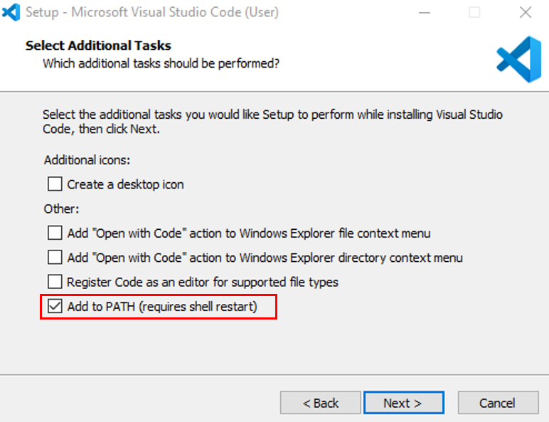
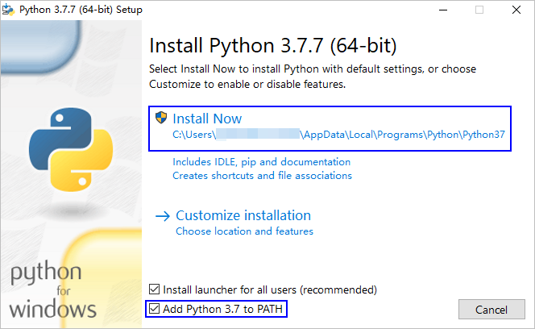
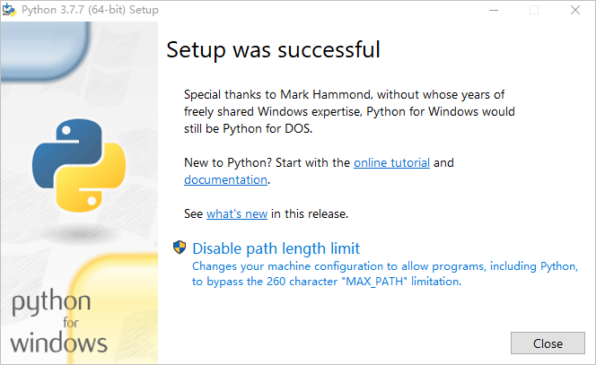
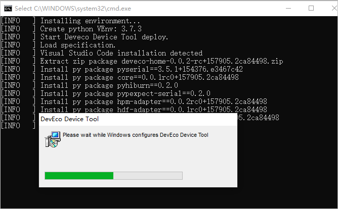
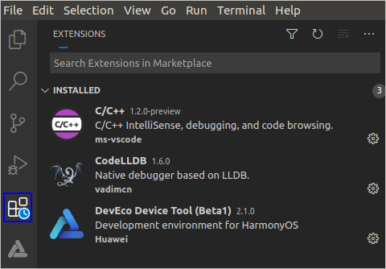

# Windows Development Environment<a name="EN-US_TOPIC_0000001105567362"></a>

-   [Obtaining the Software](#en-us_topic_0000001058091994_section1483143015558)
-   [Installing Visual Studio Code](#en-us_topic_0000001058091994_section71401018163318)
-   [Installing Python](#en-us_topic_0000001058091994_section16266553175320)
-   [Installing Node.js](#en-us_topic_0000001058091994_section5353233124511)
-   [Installing hpm](#en-us_topic_0000001058091994_section173054793610)
-   [Installing the DevEco Device Tool Plug-in](#en-us_topic_0000001058091994_section4336315185716)

Operating system: 64-bit version of Windows 10.

DevEco Device Tool is a plug-in for Visual Studio Code. The installation procedure includes five parts:

1.  Installing Visual Studio Code
2.  Installing Python
3.  Installing Node.js
4.  Installing hpm
5.  Installing the DevEco Device Tool Plug-in

## Obtaining the Software<a name="en-us_topic_0000001058091994_section1483143015558"></a>

<a name="en-us_topic_0000001058091994_table12730195765616"></a>
<table><thead align="left"><tr id="en-us_topic_0000001058091994_row6730125785610"><th class="cellrowborder" valign="top" width="19.49%" id="mcps1.1.5.1.1"><p id="en-us_topic_0000001058091994_p1573065716561"><a name="en-us_topic_0000001058091994_p1573065716561"></a><a name="en-us_topic_0000001058091994_p1573065716561"></a>Tool</p>
</th>
<th class="cellrowborder" valign="top" width="20.5%" id="mcps1.1.5.1.2"><p id="en-us_topic_0000001058091994_p197306572566"><a name="en-us_topic_0000001058091994_p197306572566"></a><a name="en-us_topic_0000001058091994_p197306572566"></a>Description</p>
</th>
<th class="cellrowborder" valign="top" width="20.03%" id="mcps1.1.5.1.3"><p id="en-us_topic_0000001058091994_p373085711569"><a name="en-us_topic_0000001058091994_p373085711569"></a><a name="en-us_topic_0000001058091994_p373085711569"></a>Version</p>
</th>
<th class="cellrowborder" valign="top" width="39.98%" id="mcps1.1.5.1.4"><p id="en-us_topic_0000001058091994_p197309576566"><a name="en-us_topic_0000001058091994_p197309576566"></a><a name="en-us_topic_0000001058091994_p197309576566"></a>Obtaining Channel</p>
</th>
</tr>
</thead>
<tbody><tr id="en-us_topic_0000001058091994_row12730155765618"><td class="cellrowborder" valign="top" width="19.49%" headers="mcps1.1.5.1.1 "><p id="en-us_topic_0000001058091994_p123931728135713"><a name="en-us_topic_0000001058091994_p123931728135713"></a><a name="en-us_topic_0000001058091994_p123931728135713"></a>Visual Studio Code</p>
</td>
<td class="cellrowborder" valign="top" width="20.5%" headers="mcps1.1.5.1.2 "><p id="en-us_topic_0000001058091994_p12332194816317"><a name="en-us_topic_0000001058091994_p12332194816317"></a><a name="en-us_topic_0000001058091994_p12332194816317"></a>Code editing tool</p>
</td>
<td class="cellrowborder" valign="top" width="20.03%" headers="mcps1.1.5.1.3 "><p id="en-us_topic_0000001058091994_p711918919618"><a name="en-us_topic_0000001058091994_p711918919618"></a><a name="en-us_topic_0000001058091994_p711918919618"></a>V1.53 or later (64-bit)</p>
</td>
<td class="cellrowborder" valign="top" width="39.98%" headers="mcps1.1.5.1.4 "><p id="en-us_topic_0000001058091994_p2721438193710"><a name="en-us_topic_0000001058091994_p2721438193710"></a><a name="en-us_topic_0000001058091994_p2721438193710"></a><a href="https://code.visualstudio.com/Download" target="_blank" rel="noopener noreferrer">https://code.visualstudio.com/Download</a></p>
</td>
</tr>
<tr id="en-us_topic_0000001058091994_row187311257185619"><td class="cellrowborder" valign="top" width="19.49%" headers="mcps1.1.5.1.1 "><p id="en-us_topic_0000001058091994_p21270444579"><a name="en-us_topic_0000001058091994_p21270444579"></a><a name="en-us_topic_0000001058091994_p21270444579"></a>Python</p>
</td>
<td class="cellrowborder" valign="top" width="20.5%" headers="mcps1.1.5.1.2 "><p id="en-us_topic_0000001058091994_p547205817316"><a name="en-us_topic_0000001058091994_p547205817316"></a><a name="en-us_topic_0000001058091994_p547205817316"></a>Programming tool</p>
</td>
<td class="cellrowborder" valign="top" width="20.03%" headers="mcps1.1.5.1.3 "><p id="en-us_topic_0000001058091994_p1991315166416"><a name="en-us_topic_0000001058091994_p1991315166416"></a><a name="en-us_topic_0000001058091994_p1991315166416"></a>v3.7.4–3.8.x (64-bit)</p>
</td>
<td class="cellrowborder" valign="top" width="39.98%" headers="mcps1.1.5.1.4 "><p id="en-us_topic_0000001058091994_p1599022403"><a name="en-us_topic_0000001058091994_p1599022403"></a><a name="en-us_topic_0000001058091994_p1599022403"></a><a href="https://www.python.org/downloads/" target="_blank" rel="noopener noreferrer">https://www.python.org/downloads/</a></p>
</td>
</tr>
<tr id="en-us_topic_0000001058091994_row117316576562"><td class="cellrowborder" valign="top" width="19.49%" headers="mcps1.1.5.1.1 "><p id="en-us_topic_0000001058091994_p16405151165717"><a name="en-us_topic_0000001058091994_p16405151165717"></a><a name="en-us_topic_0000001058091994_p16405151165717"></a>Node.js</p>
</td>
<td class="cellrowborder" valign="top" width="20.5%" headers="mcps1.1.5.1.2 "><p id="en-us_topic_0000001058091994_p1773185765616"><a name="en-us_topic_0000001058091994_p1773185765616"></a><a name="en-us_topic_0000001058091994_p1773185765616"></a>The npm environment provider</p>
</td>
<td class="cellrowborder" valign="top" width="20.03%" headers="mcps1.1.5.1.3 "><p id="en-us_topic_0000001058091994_p573118572567"><a name="en-us_topic_0000001058091994_p573118572567"></a><a name="en-us_topic_0000001058091994_p573118572567"></a>v12.0.0 or later (64-bit)</p>
</td>
<td class="cellrowborder" valign="top" width="39.98%" headers="mcps1.1.5.1.4 "><p id="en-us_topic_0000001058091994_p9200911141112"><a name="en-us_topic_0000001058091994_p9200911141112"></a><a name="en-us_topic_0000001058091994_p9200911141112"></a><a href="https://nodejs.org/en/download/" target="_blank" rel="noopener noreferrer">https://nodejs.org/en/download/</a></p>
</td>
</tr>
<tr id="en-us_topic_0000001058091994_row6731105715561"><td class="cellrowborder" valign="top" width="19.49%" headers="mcps1.1.5.1.1 "><p id="en-us_topic_0000001058091994_p2081865318571"><a name="en-us_topic_0000001058091994_p2081865318571"></a><a name="en-us_topic_0000001058091994_p2081865318571"></a>hpm</p>
</td>
<td class="cellrowborder" valign="top" width="20.5%" headers="mcps1.1.5.1.2 "><p id="en-us_topic_0000001058091994_p1632215161040"><a name="en-us_topic_0000001058091994_p1632215161040"></a><a name="en-us_topic_0000001058091994_p1632215161040"></a>Package manager</p>
</td>
<td class="cellrowborder" valign="top" width="20.03%" headers="mcps1.1.5.1.3 "><p id="en-us_topic_0000001058091994_p773185715566"><a name="en-us_topic_0000001058091994_p773185715566"></a><a name="en-us_topic_0000001058091994_p773185715566"></a>Latest version</p>
</td>
<td class="cellrowborder" valign="top" width="39.98%" headers="mcps1.1.5.1.4 "><p id="en-us_topic_0000001058091994_p14731125745610"><a name="en-us_topic_0000001058091994_p14731125745610"></a><a name="en-us_topic_0000001058091994_p14731125745610"></a>Run the following command:</p>
<pre class="screen" id="en-us_topic_0000001058091994_screen54628167163"><a name="en-us_topic_0000001058091994_screen54628167163"></a><a name="en-us_topic_0000001058091994_screen54628167163"></a>npm install -g @ohos/hpm-cli</pre>
</td>
</tr>
<tr id="en-us_topic_0000001058091994_row13317205645717"><td class="cellrowborder" valign="top" width="19.49%" headers="mcps1.1.5.1.1 "><p id="en-us_topic_0000001058091994_p143411112587"><a name="en-us_topic_0000001058091994_p143411112587"></a><a name="en-us_topic_0000001058091994_p143411112587"></a>DevEco Device Tool</p>
</td>
<td class="cellrowborder" valign="top" width="20.5%" headers="mcps1.1.5.1.2 "><p id="en-us_topic_0000001058091994_p1690316506517"><a name="en-us_topic_0000001058091994_p1690316506517"></a><a name="en-us_topic_0000001058091994_p1690316506517"></a>Plug-in for the OpenHarmony source code compilation, programming, and debugging</p>
</td>
<td class="cellrowborder" valign="top" width="20.03%" headers="mcps1.1.5.1.3 "><p id="en-us_topic_0000001058091994_p113171956185715"><a name="en-us_topic_0000001058091994_p113171956185715"></a><a name="en-us_topic_0000001058091994_p113171956185715"></a>v2.2 Beta1</p>
</td>
<td class="cellrowborder" valign="top" width="39.98%" headers="mcps1.1.5.1.4 "><p id="en-us_topic_0000001058091994_p3503163074720"><a name="en-us_topic_0000001058091994_p3503163074720"></a><a name="en-us_topic_0000001058091994_p3503163074720"></a><a href="https://device.harmonyos.com/en/ide#download" target="_blank" rel="noopener noreferrer">https://device.harmonyos.com/en/ide#download</a></p>
<p id="en-us_topic_0000001058091994_p23171856135717"><a name="en-us_topic_0000001058091994_p23171856135717"></a><a name="en-us_topic_0000001058091994_p23171856135717"></a>Log in with your HUAWEI ID to download it. You can <a href="https://developer.huawei.com/consumer/en/doc/start/registration-and-verification-0000001053628148" target="_blank" rel="noopener noreferrer">register an account here</a>.</p>
</td>
</tr>
</tbody>
</table>

## Installing Visual Studio Code<a name="en-us_topic_0000001058091994_section71401018163318"></a>

> **NOTE:** 
>If you have installed Visual Studio Code, open the CLT and run  **code --version**  to check whether the version is 1.53 or later. If the version number is returned, it indicates that the environment variables are set correctly.

1.  Double-click the Visual Studio Code package to install it. During the installation, select  **Add to PATH \(requires shell restart\)**.

    

2.  After the installation is complete, restart the computer for the environment variables of Visual Studio Code to take effect.
3.  Open the CLT and run  **code --version**. If the version number can be displayed, it indicates that the installation is successful.

## Installing Python<a name="en-us_topic_0000001058091994_section16266553175320"></a>

1.  Double-click the Python software package, select  **Add Python xx to PATH**, and click  **Install Now**.

    

2.  After the installation is complete, click  **Close**.

    

3.  Open the CLT, and run  **python --version**  to check the installation result.

    

4.  In the CLT, run the following commands to set the pip source for downloading the dependencies required for later installation:

    ```
    pip config set global.trusted-host repo.huaweicloud.com
    pip config set global.index-url https://repo.huaweicloud.com/repository/pypi/simple
    pip config set global.timeout 120
    ```


## Installing Node.js<a name="en-us_topic_0000001058091994_section5353233124511"></a>

> **NOTE:** 
>If you have installed Node.js, open the CLT and run  **node -v**  to check whether the version is 12.0.0 or later.

1.  Run the downloaded software package to install. Use the default settings when following the installation wizard, and click  **Next**  until  **Finish**  is displayed. During the installation, Node.js will automatically set the system Path environment variable to the installation directory of  **node.exe**.
2.  Open the CLT and run  **node -v**. If the version number of Node.js is displayed, it indicates that Node.js has been successfully installed.

    


## Installing hpm<a name="en-us_topic_0000001058091994_section173054793610"></a>

Before installing hpm, ensure that Node.js has been installed

and that your network can access the Internet. If your network requires a proxy to access the Internet,  [set up the npm proxy](https://device.harmonyos.com/cn/docs/ide/user-guides/npm_proxy-0000001054491032)  first.

> **NOTE:** 
>If hpm has been installed, run  **npm update -g @ohos/hpm-cli**  to update it to the latest version.

1.  You are advised to set the npm source to an image in China, for example, a HUAWEI CLOUD image source.

    ```
    npm config set registry https://repo.huaweicloud.com/repository/npm/
    ```

2.  Open the CLT and run the following command to install the latest version of hpm:

    ```
    npm install -g @ohos/hpm-cli
    ```

    

3.  After the installation is complete, run the following command to obtain the installation result:

    ```
    hpm -V
    ```

    


## Installing the DevEco Device Tool Plug-in<a name="en-us_topic_0000001058091994_section4336315185716"></a>

To install the DevEco Device Tool plug-in, ensure that the  **user name of the host cannot contain Chinese characters**; otherwise, the plug-in may fail to run.

DevEco Device Tool will automatically download and install the C/C++ and CodeLLDB plug-ins from the Visual Studio Code Marketplace during the installation process. Therefore, make sure Visual Studio Code can access the Internet. If your network requires a proxy to access the Internet,  [set up the Visual Studio Code proxy](https://device.harmonyos.com/cn/docs/ide/user-guides/vscode_proxy-0000001074231144)  first.

> **NOTE:** 
>Before installing DevEco Device Tool, ensure that Visual Studio Code is closed.

1.  Decompress the DevEco Device Tool plug-in package and double-click the installer to install.
2.  During the installation, the dependency files \(such as C/C++ and CodeLLDB plug-ins\) and execution programs required by DevEco Device Tool are automatically installed.

    

3.  After the installation is complete, the CLT is automatically closed.
4.  Open Visual Studio Code, click the    button on the left, and check whether C/C++, CodeLLDB, and DevEco Device Tool are listed in  **INSTALLED**.

    > **NOTE:** 
    >If the C/C++ and CodeLLDB plug-ins fail to be installed, DevEco Device Tool cannot run properly. To solve the issue, see  [Installing the C/C++ and CodeLLDB Plug-ins Offline](https://device.harmonyos.com/en/docs/ide/user-guides/offline_plugin_install-0000001074376846).

    


