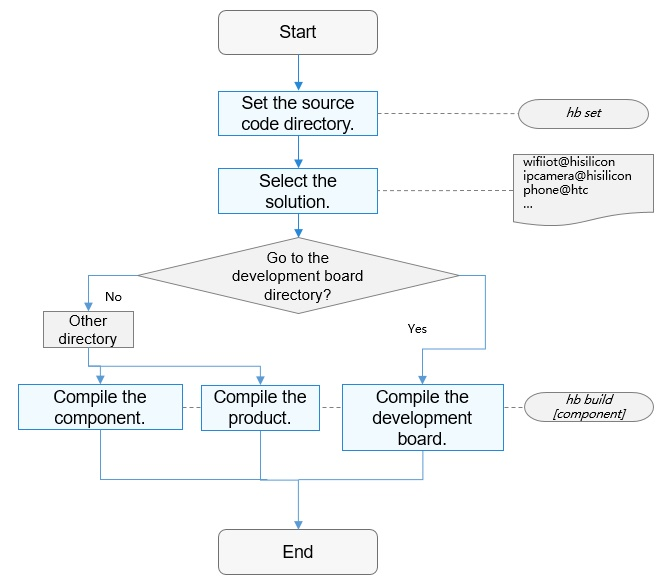

# Compilation and Building Overview<a name="EN-US_TOPIC_0000001060646620"></a>

-   [Basic Concepts](#section175012297491)
-   [Usage Guidelines](#section193961322175011)
-   [Limitations and Constraints](#section2029921310472)

The compilation and building subsystem is a building framework based on Generate Ninja \(GN\) and Ninja, which supports component-based OpenHarmony development. This subsystem can be used to:

-   Build existing products.

-   Build chipset source code independently.
-   Build a single component independently.

## Basic Concepts<a name="section175012297491"></a>

It is considered best practice to learn the following basic concepts before you start development and building:

-   **Component**

    A component is a reusable software unit that can contain source code, configuration files, resource files, and compilation scripts.

-   **GN**

    GN is short for Generate Ninja, which is used to generate Ninja files.

-   **Ninja**

    Ninja is a small high-speed building system.


## Usage Guidelines<a name="section193961322175011"></a>

1.  **Building Process**

    [Figure 1](#fig9744112715161)  shows the building process.

    **Figure  1**  Building process<a name="fig9744112715161"></a>  
    

    1.  **hb set**: Set the OpenHarmony source code directory and the product to build.
    2.  **hb build**: Build the product, development board, or component. The process to build the solution is as follows:
        -   **Reading configuration**: Read the development board configuration, which covers the toolchain, linking commands, and compilation options.
        -   **Running gn**: Run the  **gn gen**  command to read the product configuration \(related to the development board, kernel, and system components\) and generate the  **out**  directory and  **ninja**  files for the solution.
        -   **Running Ninja**: Run  **ninja -C out/company/product**  to start compilation.
        -   **Packaging**: Package the compilation result to create a file system image.


2.  **Building Commands**

    1.  **hb set**

        ```
        hb set -h
        usage: hb set [-h] [-root [ROOT_PATH]] [-p]
        
        optional arguments:
          -h, --help            show this help message and exit
          -root [ROOT_PATH], --root_path [ROOT_PATH]
                                Set OHOS root path
          -p, --product         Set OHOS board and kernel
        ```

        -   If you run  **hb set**  with no argument, the default setting process starts.
        -   You can run  **hb set -root** _dir_  to set the root directory of the source code.
        -   **hb set -p**  is used to set the product to compile.

    2.  **hb env**

        View the current configuration.

        ```
        hb env
        [OHOS INFO] root path: xxx
        [OHOS INFO] board: hispark_taurus
        [OHOS INFO] kernel: liteos
        [OHOS INFO] product: ipcamera
        [OHOS INFO] product path: xxx/vendor/hisilicon/ipcamera
        [OHOS INFO] device path: xxx/device/hisilicon/hispark_taurus/sdk_linux_4.19
        ```

    3.  **hb build**

        ```
        hb build -h
        usage: hb build [-h] [-b BUILD_TYPE] [-c COMPILER] [-t [TEST [TEST ...]]]
                        [--dmverity] [-p PRODUCT] [-f] [-n]
                        [component [component ...]]
        
        positional arguments:
          component             name of the component
        
        optional arguments:
          -h, --help            show this help message and exit
          -b BUILD_TYPE, --build_type BUILD_TYPE
                                release or debug version
          -c COMPILER, --compiler COMPILER
                                specify compiler
          -t [TEST [TEST ...]], --test [TEST [TEST ...]]
                                compile test suite
          --dmverity            Enable dmverity
          -p PRODUCT, --product PRODUCT
                                build a specified product with
                                {product_name}@{company}, eg: ipcamera@hisilcon
          -f, --full            full code compilation
        ```

        -   If you run  **hb build**  with no argument, the previously configured code directory, product, and options are used for the compilation. The  **-f**  option will delete all products to be compiled, which is equivalent to running  **hb clean**  and  **hb build**.
        -   You can run  **hb build** _\{component\_name\}_  to compile product components separately based on the development board and kernel set for the product, for example,  **hb build kv\_store**.
        -   You can run  **hb build -p ipcamera@hisilicon**  to skip the setting step and compile the product directly.
        -   You can run  **hb build**  in  **device/device\_company/board**  to select the kernel and start compilation based on the current development board and the selected kernel to generate an image that contains the kernel and driver only.

    4.  **hb clean**

        Clear the compilation result of the product in the  **out**  directory, and retain the  **args.gn**  and  **build.log**  files only. To clear files in a specified directory, add the directory parameter to the command, for example,  **hb clean** _xxx_**/out/**_xxx_.


    ```
    hb clean
    usage: hb clean [-h] [out_path]
    
    positional arguments:
      out_path    clean a specified path.
    
    optional arguments:
      -h, --help  show this help message and exit
    ```


## Limitations and Constraints<a name="section2029921310472"></a>

Ensure that the development environment has GN and Ninja, Python 3.7.4 and later, and hb commands. You must download the complete code before you start.

