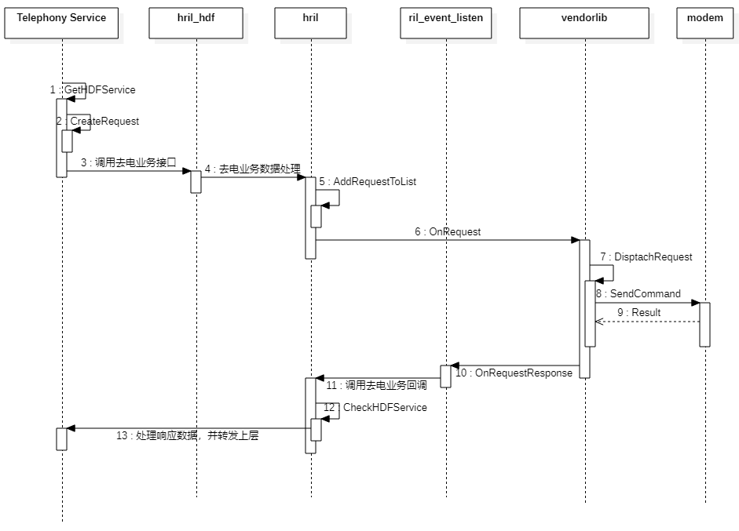
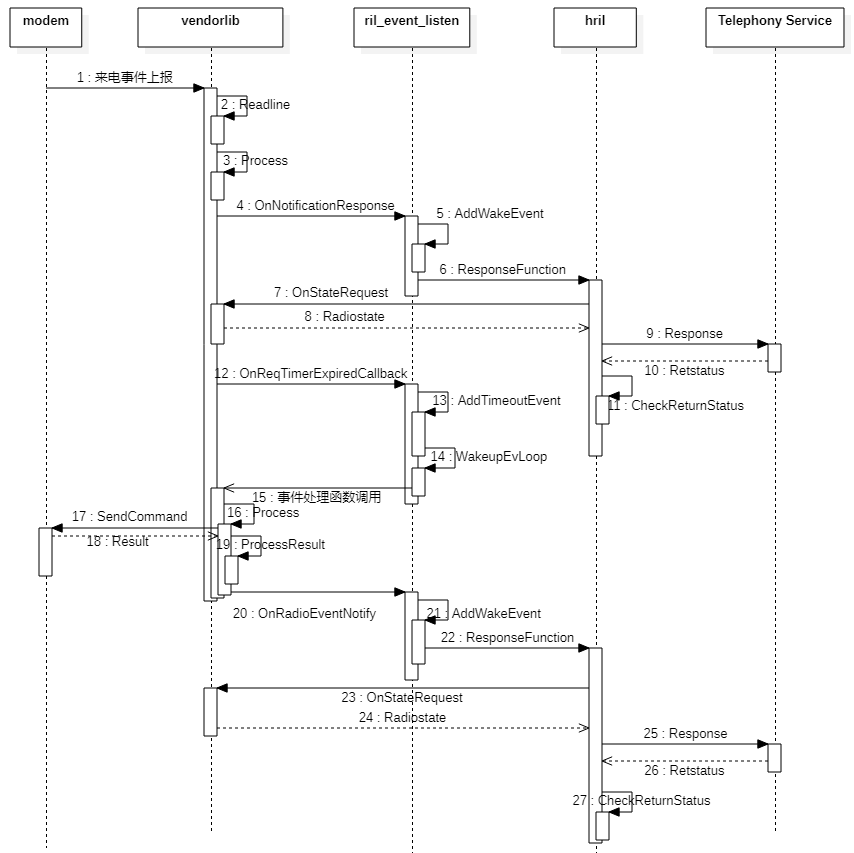

# 开发实例<a name="ZH-CN_TOPIC_0000001144061261"></a>

-   [去电开发实例](#section286643718507)
-   [来电开发实例](#section3205350105014)

## 去电开发实例<a name="section286643718507"></a>

去电的调用流程示例如下图所示：

**图 1**  去电调用流程图<a name="fig182512371267"></a>  




当应用触发去电动作时，RIL Adapter会接收到拨打电话的请求，OnRequest\(\)会根据拨打电话请求ID调用拨打电话的接口。在该接口里会把电话服务传过来的数据封装为对应的AT指令发送到Modem，Modem执行完拨号命令后通过OnRequestResponse\(\)接口把响应结果上报给RIL Adapter。

```
#include <stdio.h> 
#include <string.h> 
#include <errno.h> 
#include <alloca.h> 
#include "atchannel.h" 
#include "at_tok.h" 
#include "hdf_log.h" 
#include "ril.h" 

static void OnRequest(int request, void *data, size_t datalen, RIL_Token token)
{
    HDF_LOGI("OnRequest request = %{public}d start \n", request);
    switch (request) {
        case HREQ_CALL_DIAL:
            SendDialRequest(data, datalen, token);
            break;
            ……
        default:
            break;
    }
}
 
// 将去电ID和参数转换成对应的AT命令，通过send_at_request发送给Modem
static void SendDialRequest(void *data, size_t datalen __unused, RIL_Token token)
{
    char *atCmd;
    const char *clir;
    int ret;
    DialInfo *pDial;
    pDial = (DialInfo *) data;

    if (!strncmp(pDial->address, "*31#", 4)) {
        HDF_LOGI("clir suppression");
        clir = "i";
        num = (char *)&(pDial->address[4]);
    } else if (!strncmp(pDial->address, "#31#", 4)) {
        HDF_LOGI("clir invocation");
        clir = "I";
        num = (char *)&(pDial->address[4]);
    } else {
        HDF_LOGI("set clir state to default");
        clir = "";
        num = (char *)pDial->number;
    }

    asprintf(&atCmd, "ATD%s%s;", pDial->address, clir);
    ret = send_at_request(atCmd, NULL);
    free(atCmd);
    // 命令执行完成后调用该接口，将Modem执行的结果反馈给RIL Adapter
    OnRequestResponse(t, RIL_RESULT_SUCCESS, NULL, 0);
}
```

## 来电开发实例<a name="section3205350105014"></a>

来电的调用流程示例如下图所示：

**图 2**  来电调用流程图<a name="fig11621520133015"></a>  




Modem设备节点读取线程s\_tid\_read会循环读取Modem上报的消息，当Modem接收到来电时会主动上报来电相关的信息；

当该线程通过调用OnNotificationResponse\(\)解析到Modem上报的数据是以"+CRING"、"RING"等字符开头时，表示有来电事件，然后通过OnRadioEventNotify\(HNOTI\_CALL\_STATUS,  NULL, 0\)上报给RIL Adapter完成来电事件上报。

```
#include <stdio.h> 
#include "atchannel.h" 
#include "at_tok.h" 
#include "hdf_log.h" 
#include "ril.h" 

bool IsCallStatusUpdated(const char *s)
{
    return (StrBeginWith(s, "+CRING:") 
        || StrBeginWith(s, "RING") 
        || StrBeginWith(s, "NO CARRIER") 
        || StrBeginWith(s, "+CCWA"));
}

// 将Modem上报数据解析为对应的Modem事件 
static void OnNotificationResponse(const char *s, const char *sms_pdu) 
{ 
    char *line = NULL, *p; 
    HDF_LOGI("OnNotificationResponse = %{public}s sState = %{public}d", s, sState); 
    // 解析到以"+CRING:"等字符开头的数据时，转换为来电事件 
    if (IsCallStatusUpdated(s)) { 
        // 通知RIL Adapter有来电事件 
        OnRadioEventNotify(HNOTI_CALL_STATUS, NULL, 0); 
    } 
    …… 
}
```

