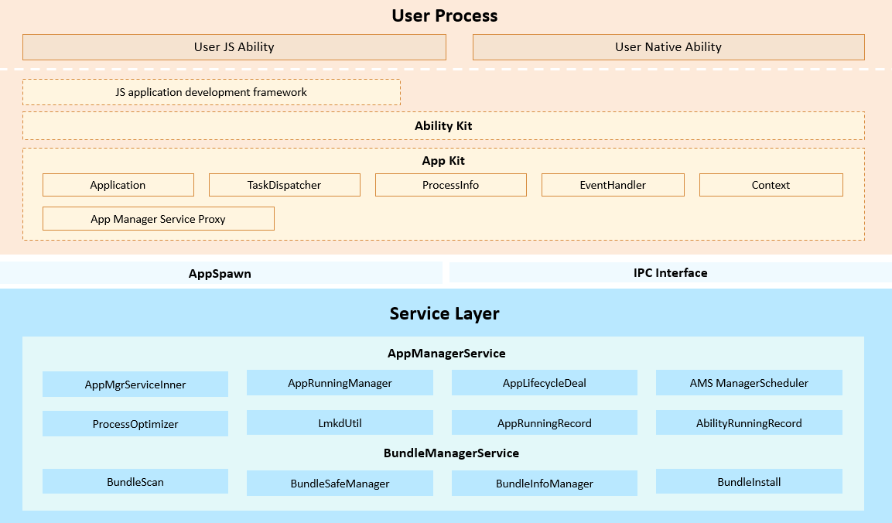

# **用户程序框架子系统**

## 简介

用户程序框架子系统是OpenHarmony为开发者提供的一套开发OpenHarmony应用程序的框架。

**包含以下模块**：

- **AppKit**：是用户程序框架提供给开发者的开发包，开发者基于该开发包可以开发出基于Ability组件的应用。

- **AppManagerService**：应用管理服务，用于管理应用运行关系、调度应用进程生命周期及状态的系统服务。

- **BundleManagerService**：是负责管理安装包的系统服务，常见的比如包安装、更新，卸载和包信息查询等，运行在Foundation进程。

应用程序框架子系统架构如下图所示：




## 目录

```
foundation/appexecfwk/standard
├── kits
│   └── appkit						   # Appkit实现的核心代码
├── common
│   └── log							   # 日志组件目录
├── interfaces
│   └── innerkits					   # 内部接口存放目录
├── services
│   ├── appmgr						   # 用户程序管理服务框架代码
│   └── bundlemgr	                   # 包管理服务框架代码
├── test						       # 测试目录
└── tools                              # bm命令存放目录
```

### 使用说明

当前版本用户程序框架不具备权限管理的能力。

以下模块的JS接口为非正式API，仅供Launcher、Settings、SystemUI等系统应用使用，不排除对这些接口进行变更的可能性，后续版本将提供正式API。

- @ohos.bundle_mgr.d.ts
- bundleinfo.d.ts
- common.d.ts
- installresult.d.ts
- moduleinfo.d.ts


### bm命令如下

**bm命令帮助**

| 命令    | 描述       |
| ------- | ---------- |
| bm help | bm帮助命令 |

**安装应用**

| 命令                                | 描述                       |
| ----------------------------------- | -------------------------- |
| bm install -p <bundle-file-path>    | 通过指定路径安装一个应用包 |
| bm install -r -p <bundle-file-path> | 覆盖安装一个应用包         |

```
示例如下：
bm install -p /data/app/ohosapp.hap
```

**卸载应用**

| 命令                          | 描述                     |
| ----------------------------- | ------------------------ |
| bm uninstall -n <bundle-name> | 通过指定包名卸载一个应用 |

```
示例如下：
bm uninstall -n com.ohos.app
```

**查看应用安装信息**

| 命令       | 描述                       |
| ---------- | -------------------------- |
| bm dump -a | 列出系统已经安装的所有应用 |

## 相关仓

用户程序框架子系统

**appexecfwk_standard**

aafwk_standard

startup_appspawn
