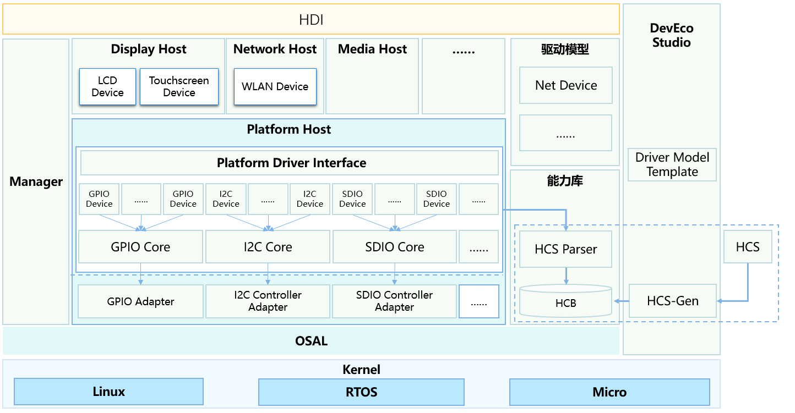
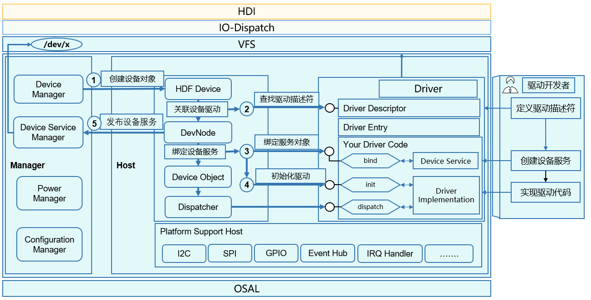
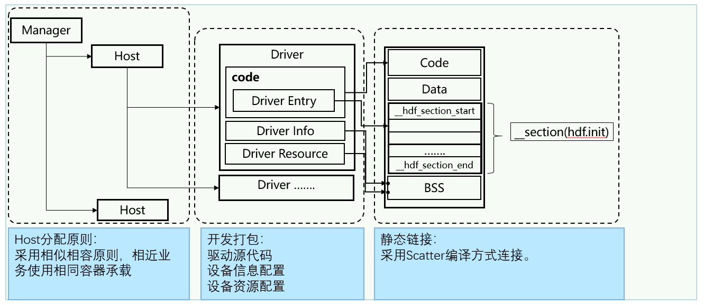

# 驱动子系统<a name="ZH-CN_TOPIC_0000001052619216"></a>

-   [简介](#section11660541593)
-   [架构](#section101721227145613)
-   [目录](#section1464106163817)
-   [使用](#section8496817141616)
-   [安装](#section14778154275818)
-   [涉及仓](#section134812226297)

## 简介<a name="section11660541593"></a>

OpenHarmony驱动子系统采用C面向对象编程模型构建，通过平台解耦、内核解耦，兼容不同内核，提供了归一化的驱动平台底座，旨在为开发者提供更精准、更高效的开发环境，力求做到一次开发，多系统部署。

为了缩减驱动开发者的驱动开发周期，降低三方设备驱动集成难度，OpenHarmony驱动子系统支持以下关键特性和能力。

-   弹性化的框架能力：

    在传统的驱动框架能力的基础上，OpenHarmony驱动子系统通过构建弹性化的框架能力，可支持在百K级别到百兆级容量的终端产品形态部署。


-   规范化的驱动接口：

    定义了常见驱动接口，为驱动开发者和使用者提供丰富、稳定接口，并和未来开放的面向手机、平板、智慧屏等设备驱动接口保持API兼容性。


-   组件化的驱动模型：

    支持组件化的驱动模型，为开发者提供更精细化的驱动管理，开发者可以对驱动进行组件化拆分，使得驱动开发者可以更多关注驱动与硬件交互部分。

    同时系统也预置了部分模板化的驱动模型组件，如网络设备模型等。


-   归一化的配置界面：

    提供统一的配置界面，构建跨平台的配置转换和生成工具，实现跨平台的无缝切换


为了方便驱动开发者更易于开发OpenHarmony驱动程序，OpenHarmony驱动子系统在DevEco集成了驱动开发套件工具，支持驱动工程管理，驱动模板生成、配置管理等界面化的操作。

## 架构<a name="section101721227145613"></a>

OpenHarmony驱动框架采用主从架构设计模式，围绕着框架、模型、能力库和工具四个维度能力展开构建。

**图 1**  驱动架构图<a name="fig1077923710115"></a>  


-   驱动框架 -位于framework/core目录
    -   提供驱动框架能力，主要完成驱动加载和启动功能。
    -   通过对象管理器方式可实现驱动框架的弹性化部署和扩展。

-   驱动模型 - 位于framework/model目录
    -   提供了模型化驱动能力，如网络设备模型。

-   驱动能力库 - 位于framework/ability目录
    -   提供基础驱动能力模型，如IO通信能力模型。

-   驱动工具 - 位于framework/tools目录
    -   提供HDI接口转换、驱动配置编译等工具。

-   驱动接口 - 位于lite/hdi目录
    -   提供规范化的驱动接口。

-   Support - 位于framework/support目录
    -   提供规范化的平台驱动接口和系统接口抽象能力。


## 目录<a name="section1464106163817"></a>

```
drivers
├── adapter               #适配平台差异性的代码
├── framework             #驱动框架核心代码
└── peripheral            #外设驱动代码
```

## 使用<a name="section8496817141616"></a>

**图 2**  驱动框架交互流程<a name="fig1356181413429"></a>  


驱动框架完成大部分驱动加载的动作，用户只需注册自己所需的接口和配置，然后驱动框架就会解析配置的内容，完成驱动加载和初始化动作。

开发者基于HDF驱动框架开发的驱动主要包含三大部分：

1、驱动程序部分 - 完成驱动的功能逻辑。

2、驱动配置信息 - 指示驱动的加载信息内容。

3、驱动资源配置 - 配置驱动的硬件配置信息。

驱动程序主要是完成驱动功能的开发部分：

对于开发者首先看到的是驱动入口部分，驱动入口部分通过DriverEntry对其进行描述。

其中主要包含bind, init 和release三个接口。

```
struct HdfDriverEntry g_deviceSample = {
    .moduleVersion = 1,
    .moduleName = "sample_driver", 
    .Bind = SampleDriverBind,
    .Init = SampleDriverInit,
    .Release = SampleDriverRelease,
};
```

Bind接口描述：该接口的作用主要是完成驱动设备和设备服务接口的bind动作。

```
int32_t SampleDriverBind(struct HdfDeviceObject *deviceObject)
{
    // TODO: Bind device service to device object.
    // And you can also initialize device resources here.
    return HDF_SUCCESS;
}
```

Init接口描述：当框架完成设备绑定动作后，就开始调用驱动初始化接口，当初始化成功后，驱动框架根据配置文件决定是否对外创建设备服务接口，还是只是对当前服务接口可见。如果Init初始化失败的话，驱动框架就会主动释放创建的设备接口等信息。

```
int32_t SampleDriverInit(struct HdfDeviceObject *deviceObject)
{
    // TODO: Init hardware or other resources here.
    return HDF_SUCCESS;
}
```

Release接口描述：当用户需要卸载驱动时，驱动框架先通过该接口通知驱动程序释放资源。然后在执行其他内部资源释放。

```
void SampleDriverRelease(struct HdfDeviceObject *deviceObject)
{
    // Release all resources.
    return;
}
```

## 安装<a name="section14778154275818"></a>

OpenHarmony驱动主要部署在内核态，当前主要采用静态链接方式，随内核子系统编译和系统镜像打包。

**图 3**  驱动安装部署图<a name="fig20119729154211"></a>  


## 涉及仓<a name="section134812226297"></a>

**驱动子系统**

[drivers\_framework](https://gitee.com/openharmony/drivers_framework/blob/master/README_zh.md)

[drivers\_adapter](https://gitee.com/openharmony/drivers_adapter/blob/master/README_zh.md)

[drivers\_adapter\_khdf\_linux](https://gitee.com/openharmony/drivers_adapter_khdf_linux/blob/master/README_zh.md)

[drivers\_peripheral](https://gitee.com/openharmony/drivers_peripheral/blob/master/README_zh.md)

